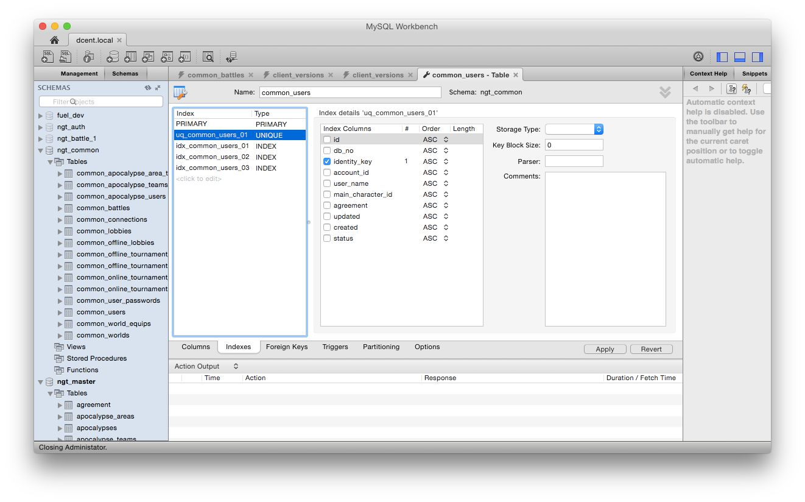
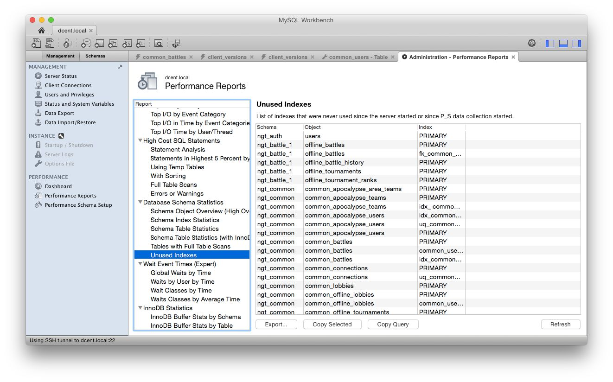

Title: [MySQL] MySQLDBチューニング : INDEX編  
Date: 2021-01-12 00:00  
Modified: 2021-01-12 00:00  
Category: Tech  
Tags: トイズクリエイション, ToysCreation, MySQL, MySQLWorkbench   
Slug: mysql_performance_index  
Authors: ToysCreation.Inc morita  
Summary: [MySQL] MySQLDBチューニング : INDEX編  
Cover:  

## 概要
MySQLWorkbenchのPerformance Reports機能を用いてDB INDEXの調査と確認、設定を行うマニュアルです。

### 前提条件
* MySQLDB限定である(mariaDBは未検証)
* MySQLWorkbenchがインストールされていること

### 環境
* mysqld: Ver 5.6.23 for Linux on x86_64 (MySQL Community Server (GPL))
* MySQLworkbench : v6.2.4

### 参照資料
* PerformanceReportsについての資料
  - http://www.slideshare.net/yoyamasaki/20131110-tuning-onmysql56
* DBチューニング入門(INDEX関連)
  - http://sssslide.com/www.slideshare.net/infinite_loop/mysql-indexexplain

---------------

## 事前準備

* MySQLの設定変更
* MySQLWorkbenchのPerformanceReportsを有効化


###　1.MySQLの準備

#### 1.DB設定の変更
* APIが発行するSQLをログから確認のするためMySQLの設定を記述する。

```
$ vim /etc/my.cnf
```
設定内容は以下の通りになります。

```
[mysqld]
# debug
slow_query_log=1 #スロークエリログ出力有効化
slow_query_log_file=/var/log/mysqld-slow.log #スロークエリログファイル名
long_query_time=2 #スロークエリとして認識させる時間[秒]
general_log=1
general_log_file=/var/log/mysqld-query.log
log-queries-not-using-indexes = 1

```
### 2.MySQLWorkBenchの準備

#### 1. PerformanceReportsをインストール

* MySQLWorkBenchを起動してPerformanceReportsを有効にする。
(※有効にするとPerformancereportsが利用するDB "sys"が作成される)

1. メニュー "Management" をクリック
2. 項目 "Performance schema Setup" をクリック。
  機能を利用するための有効化(インストールっぽい)するボタンがあるので、すべて有効になるようにクリック。
3. 画面中央のバー "Performance schema"のバーが"Server default"に変更する。
  (詳細は下記の画像参照) 


### APIが発行するSQL Query調査, EXLPAIN確認, DBschema変更
調査を始める前の注意点として、事前にPerformanceReportsのLogをクリアしておく必要がある。  
クリア方法については '99.PerformanceReports(Log)のリセット' を参照して下さい。

#### 1. INDEXが最適化されていないQueryの調査
1. 調査対象のAPIを実行する。(Queryを発行する)
2. MySQLWorkbenchより　メニュー "Management" -> "PerformanceReposts" を開く
3. 項目 "High Cost SQL statements" -> "Full Scan Tables"の項目を開く

"Full Scan Tables"ではQuery単位でINDEXが最適化されていないことが確認できる。


* INDEXが利用されていないテーブル単位で確認する場合は以下の通り
  1. MySQLWorkbenchより　メニュー "Management" -> "PerformanceReposts" を開く
  2. 項目 "Database schema statements" -> "Tables With Full Scan Tables"の項目を開く

* カラムの"Object"が特定のQueryによってINDEXが利用されていないテーブルとなる。

(詳細画面)


* この項目で表示されているインデックスは利用されていないインデックスキーとなります。  表示の詳細は以下の通りです。
  - Schema : データベース
  - Object : テーブル
  - Index : INDEXキー

#### 2. EXPLAIN確認
* ログより実際に発行されているQueryを確認する。ログは以下の通りです。
  - /var/log/mysqld-query.log
* Queryの中で発行されているSQL文をコピーしてMySQLWorkbench上に書きEXPALINを実行する。

(詳細画面)


#### 3. DBschema変更(INDEX設定)

* 変更したいテーブルにカーソルを合わせて、スパナマークのボタンをクリック。(設定画面を開く)
* 画面下部にある"Indexes"タブをクリックして、INDEX設定画面よりINDEXを設定する。

(詳細画面)


* 設定が完了したらもう一度EXPLAINよりQueryを確認して想定通りに動作しているか確認する。

#### 4.不要のINDEX調査
* 実際にINDEXが設定されているが利用されていない場合の調査方法は以下の通りになります。
- 事前にPerformanceReportsのLogをクリアしておく必要がある。  
  クリア方法については '99.PerformanceReports(Log)のリセット' を参照して下さい。  

1. 全APIを実行する。
  2. MySQLWorkbenchより　メニュー "Management" -> "PerformanceReposts" を開く
  3. 項目 "Database schema statements" -> "Unset Indexes"の項目を開く

(詳細画面)



### 99.PerformanceReports(Log)のリセット
1. メニュー "Management" をクリック
2. 項目 "Performance schema Setup" をクリック。
3. "Clear Event Tables"をクリックしてクリアする。  

(詳細画面)

