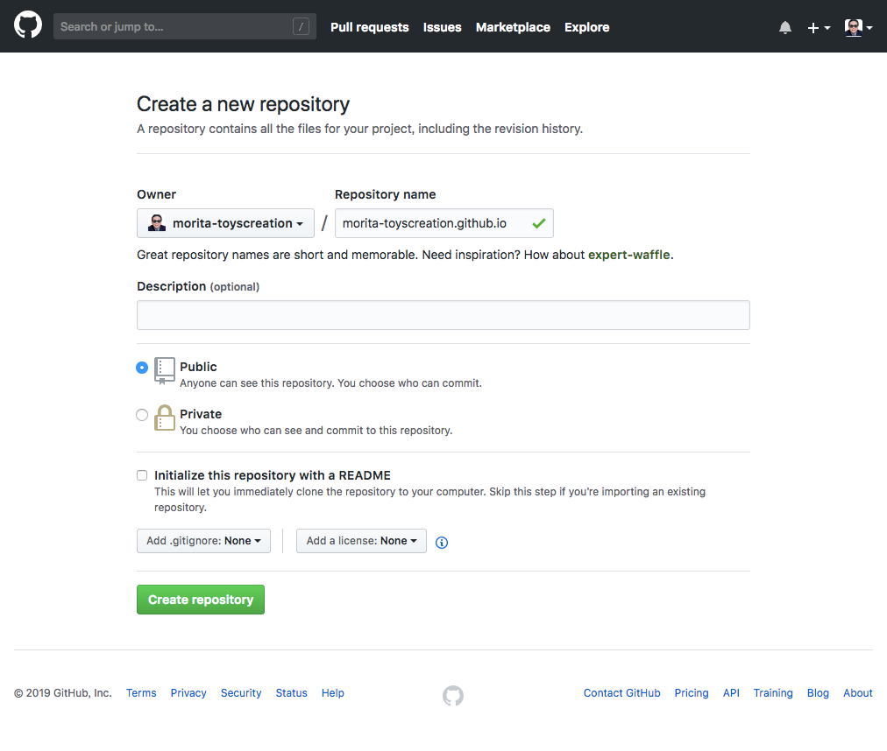
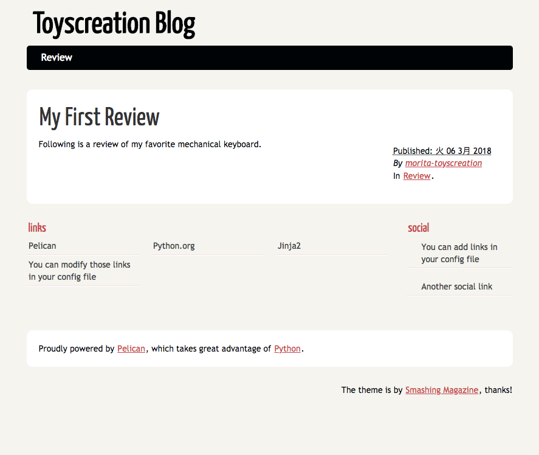

Title: [Python] PelicanとGithub Pagesで簡単ブログ作成  
Date: 2019-01-02 00:00  
Modified: 2019-01-02 00:00  
Category: Tech  
Tags: トイズクリエイション, ToysCreation, Python, Pelican, GitHub  
Slug: pelican_in_githubio  
Authors: ToysCreation.Inc morita  
Summary: [Python] PelicanとGithub Pagesで簡単ブログ作成  
Cover:  

Pythonインストール・設定がまだの場合は[[Python] MacにPythonのローカル開発環境を構築](/python_in_local_install.html#python_in_local_install)を参照  

**ディレクトリを作成**
```ps1
$ mkdir morita-toyscreation.github.io
$ cd morita-toyscreation.github.io
```

**virtualenv設定**
```ps1
$ pyenv virtualenv 3.6.3 morita-toyscreation.github.io
$ pyenv local morita-toyscreation.github.io
$ pip install --upgrade pip
$ pip install --upgrade setuptools
```

**pipインストール**
```ps1
$ pip install pelican
$ pip install ghp-import
$ pip install Markdown
$ pip install typogrify
```

**githubにてmorita-toyscreation.github.ioブランチを作成**


**pelican クイックスタート**
```ps1
$ pelican-quickstart
```

**pelican 初期設定**
※ 下記はローカルで確認だけに設定

```ps1
> Where do you want to create your new web site? [.]
> What will be the title of this web site? Toyscreation Blog
> Who will be the author of this web site? morita-toyscreation
> What will be the default language of this web site? [ja]
> Do you want to specify a URL prefix? e.g., http://example.com   (Y/n) Y
> What is your URL prefix? (see above example; no trailing slash) https://morita-toyscreation.github.io
> Do you want to enable article pagination? (Y/n) Y
> How many articles per page do you want? [10]
> What is your time zone? [Europe/Paris] Asia/Tokyo
> Do you want to generate a Fabfile/Makefile to automate generation and publishing? (Y/n) Y
> Do you want an auto-reload & simpleHTTP script to assist with theme and site development? (Y/n) Y
> Do you want to upload your website using FTP? (y/N) N
> Do you want to upload your website using SSH? (y/N) N
> Do you want to upload your website using Dropbox? (y/N) N
> Do you want to upload your website using S3? (y/N) N
> Do you want to upload your website using Rackspace Cloud Files? (y/N) N
> Do you want to upload your website using GitHub Pages? (y/N) y
> Is this your personal page (username.github.io)? (y/N) y
Done. Your new project is available at /Users/xxxxx/Sites/morita-toyscreation.github.io
```

**ブランチ作成**
```ps1
$ git init 
$ git checkout -b pelican
```

**記事の作成**
```ps1
$ vi content/keyboard-review.md

Title:My First Review
Date: 2018-03-06 09:00
Category: Review

Following is a review of my favorite mechanical keyboard.
```

**ローカル確認**
```ps1
$ make devserver
```

ブラウザで確認できます。  
http://localhost:8000/

開発サーバー停止
```ps1
$ make stopserver
```

**MarkdownをHTMLに変換**
```ps1
$ pelican content -o output -s pelicanconf.py
```

**pelicanブランチをPush**
```ps1
$ git add .
$ git commit -m "first web site."
$ git push origin pelican
```

**Github Pages用デプロイ**
```ps1
$ ghp-import output -b master -m "Published."
```

**masterブランチをPush**
```ps1
$ git checkout master
$ git add .
$ git commit -m "Published."
$ git push origin master
```

**ブログ作成完了**  
ブラウザでサイトを確認（少し待つ場合があるみたいです。）  
https://morita-toyscreation.github.io/
