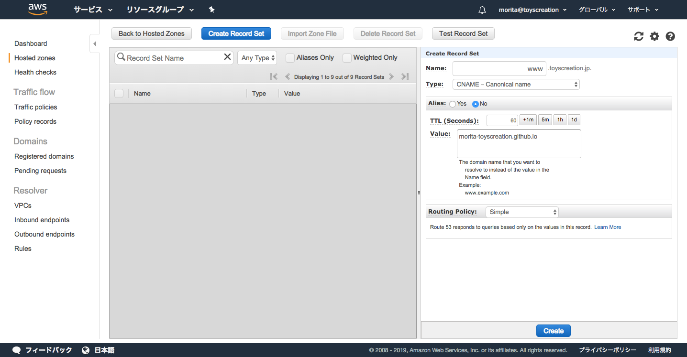
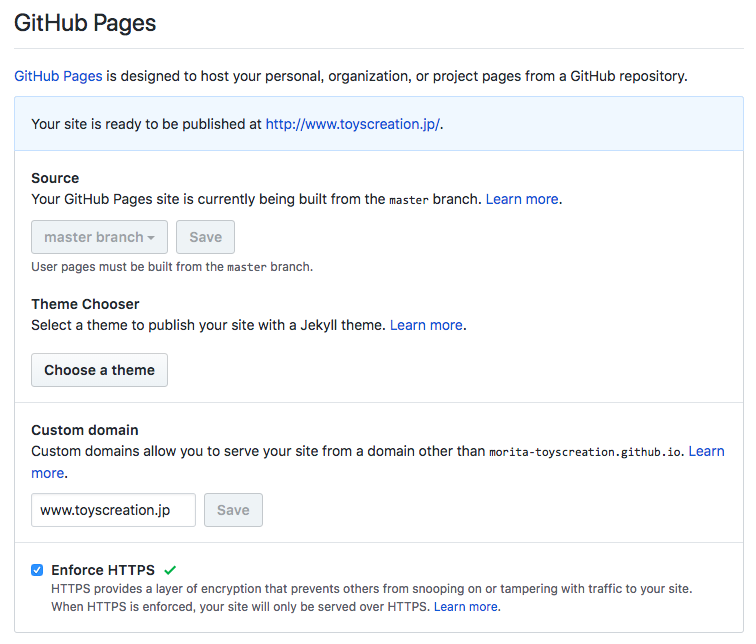

Title: [Python] PelicanとGithub Pagesで作成したブログを独自ドメインとHTTPS対応  
Date: 2019-01-03 00:00  
Modified: 2019-01-03 00:00  
Category: Tech  
Tags: トイズクリエイション, ToysCreation, Python, Pelican, GitHub    
Slug: pelican_in_own_domain  
Authors: ToysCreation.Inc morita  
Summary: [Python] PelicanとGithub Pagesで作成したブログを独自ドメインとHTTPS対応  
Cover:  

Pythonインストール・設定がまだの場合は[[Python] MacにPythonのローカル開発環境を構築](/python_in_local_install.html#python_in_local_install)を参照  
PelicanとGithub Pagesでブログ作成がまだの方は[[Python] PelicanとGithub Pagesで簡単ブログ作成](/pelican_in_githubio.html#pelican_in_githubio)を参照。

**DNSレコード設定**  
toyscreation.jpのドメインはAWSのRoute53で管理しているため、
Route53にてDNSレコード設定を行います。  
```ps1
Name: www  
Type: CNAME - Canonical name  
Value: morita-toyscreation.github.io
```



**GitHub Pages設定**
対象ブランチのSettingsにてGitHub Pages設定を行います。
```ps1
Custom domain: www.toyscreation.jp
Enforce HTTPS: チェック
```



**独自ドメインとHTTPS対応完了**  
ブラウザでサイトを確認  
https://www.toyscreation.jp

