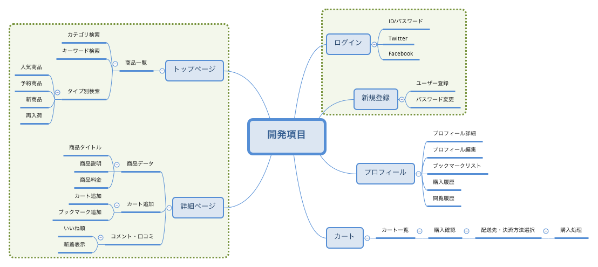
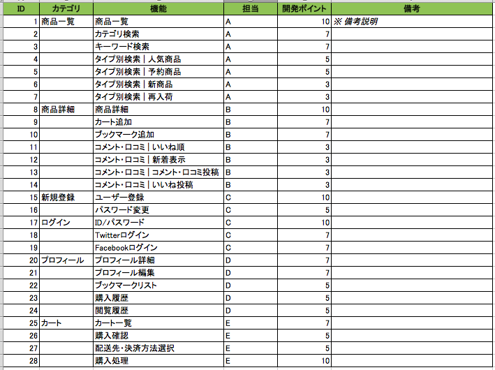
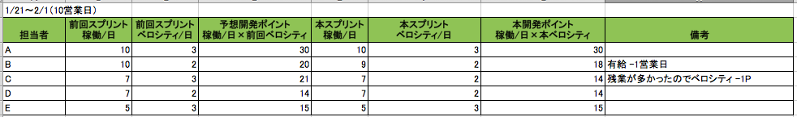
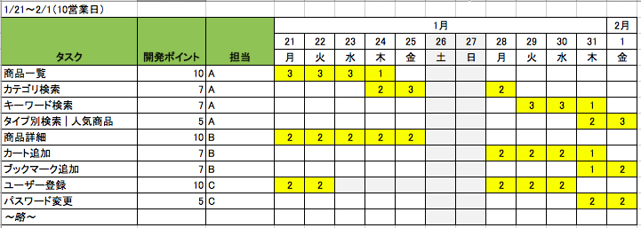

Title: [PM] プロジェクトマネジメントが行うべきこと  
Date: 2019-01-19 00:00  
Modified: 2019-01-19 00:00  
Category: Tech  
Tags: トイズクリエイション, ToysCreation, PM, プロジェクトマネジメント, RedMine, Backlog   
Slug: pm_in_all  
Authors: ToysCreation.Inc morita  
Summary: [PM] プロジェクトマネジメントが行うべきこと  
Cover:  

**1, ミーティングをして項目の洗い出しを行う。**  
依頼人より本スプリントで開発したいことをヒアリングする。  
スプリント期間に収まるボリュームでヒアリングすることを心がける。  
マインドマップなどを使用して整理するのがオススメ。  

_※ 資料はサンプル_  

**2, 項目より開発ポイントを算出する。**  
A, 開発ポイントは、開発メンバー数名と話し合い、開発ポイントを１～１０内で決める。  
B, 担当者の割り当て。共通の開発項目をまとめ、A担当、B担当、C担当などとして担当者を決める。  
  
_※ 資料はサンプル_  

**3, 開発メンバーのベロシティ（開発速度）の算出する。**  
A, 前回のスプリントから開発メンバーのベロシティを算出する。（初回は想定ベロシティで良い。）  
B, 前回のベロシティ×稼働日数を開発メンバーの開発メンバーが消化可能な合計開発ポイントを算出する。    
C, 開発ポイントに合うように、スプリント項目を振っていく。  
  
_※ 資料はサンプル_  

**4, スケジュールの作成する。**
A, 2で出した項目と3で出したベロシティからスケジュール化する。  
B, 優先順位で並び替える。  
C, そのあとに線を引いていく。  
  
_※ 資料はサンプル_  

**5, 共有**  
A, ミーティングにて4を共有し説明を行う。1〜3は共有してもいいし、しなくてもよい。  
B, RedMine、Backlogなどでタスク管理ツールにてタスクを発行する。  
